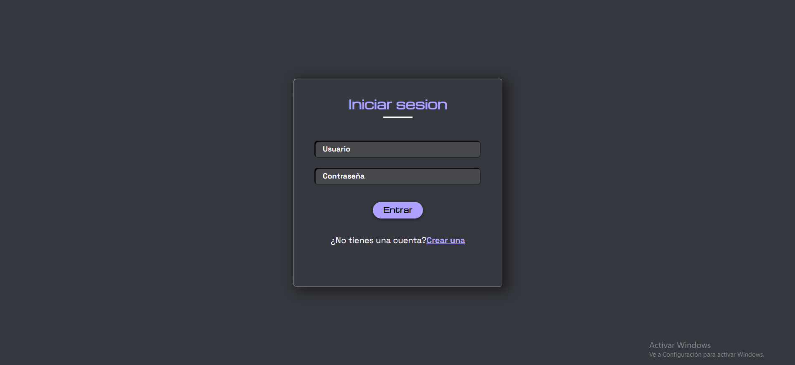

# 🖥️ Frontend - Lista de Tareas con HTML, CSS y JS

<p align="center">
  
</p>

## Descripción

Este proyecto contiene el **frontend** de la aplicación de lista de tareas.  
Permite al usuario **registrarse, iniciar sesión, agregar y eliminar tareas**, mostrando la información de manera interactiva y conectándose al backend vía **API REST**.

El frontend está desarrollado con:

- **HTML5** → estructura de la página.
- **CSS3** → estilos, animaciones y diseño responsivo.
- **JavaScript** → interactividad, manejo de formularios y comunicación con el backend.

---

## Tecnologías utilizadas

- HTML5
- CSS3
- JavaScript (ES6+)
- Fetch API para comunicación con el backend

👉Estas tecnologías fueron elegidas **principalmente** por poseer cierto **dominio** previo de las mismas, ademas de ser estándares web universales que, combinadas, permiten separar la estructura (HTML), el estilo (CSS) y la lógica (JS), lo que hace el código más organizado y escalable.

---

## Instalación y configuración

1. **Clonar el repositorio**
   ```bash
   git clone https://github.com/Ferjud/Frontend.github.io.git
   cd frontend
   ```

Ó

Copiar y pegar los códigos de cada archivo del repositorio Frontend manualmente.

---

## Ejemplo de uso

1. Abrir index.html en el navegador (Corriendo el servidor como se detalla en README del backend o para una visualización rápida, usar Live Server de VSCode).

2. Registrarse con un nuevo usuario.

3. Iniciar sesión con ese usuario.

4. Agregar tareas en el panel de "Home".

5. Eliminar tareas haciendo clic en el botón X al lado de cada tarea.
